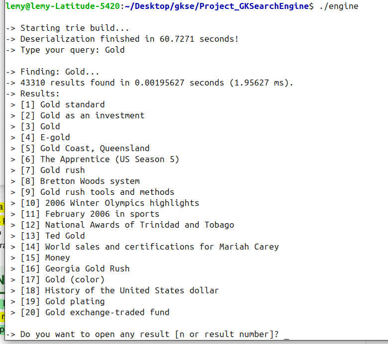

# GK'SE — Great Knights' Search Engine

Full-text search engine built with a Trie data structure, developed as the final project for the Data Structures & Algorithms course at FGV (Fundacao Getulio Vargas), 2020.

The engine indexes the WikiCorpus (English Wikipedia articles) — over 1.6 million documents and 3.2 million unique words — and returns results ranked by term frequency in under 1ms. When a query has no exact match, similar words are suggested using Levenshtein distance computed directly on the Trie.



## How it works

**Indexing.** Python scripts in `DataTreatment/` extract words, titles and article texts from the raw WikiCorpus files. Each word is inserted into a Trie where leaf nodes store `(document_id, frequency)` pairs. The full Trie is serialized to a single file (`trieSerial`, ~2.4GB) for fast loading.

**Search.** Multi-word queries are resolved by looking up each word in the Trie and intersecting the result vectors in O(n+m). Results are sorted by frequency so the most relevant documents appear first.

**Suggestions.** When a word isn't found, the engine walks the Trie while computing Levenshtein edit distance row by row (dynamic programming), pruning branches that exceed a cost threshold of 2. This finds similar words without scanning a flat dictionary.

## Structure

```
engine.cpp            # Interactive terminal search
engine_server.cpp     # JSON-output variant for the web interface
trie.cpp              # Trie: insert, find, suggest, serialize/deserialize
trie_builder.cpp      # Trie construction from preprocessed word files
Pair.cpp              # (doc_id, frequency) pair with frequency-based ordering

web_interface/
  server.py           # Python HTTP server wrapping engine_server
  index.html          # Minimalist dark web frontend

DataTreatment/        # Python preprocessing pipeline
Serialization/        # Trie serialization helpers
Search_engine-servidor/  # Original C++ HTTP server (Boost)
aNames/               # Article title index files
```

## Requirements

- g++ with C++17 support
- Python 3 (for the web interface server)
- ~5GB RAM at runtime (Trie in memory)
- WikiCorpus data files (`raw.en/`) for building from scratch
- Pre-built `trieSerial` file for running without rebuilding

The data files (`trieSerial`, `aTexts/`, `raw.en/`) are too large for git. See `COMO_EXECUTAR.txt` for download instructions.

## Usage

### Terminal

```bash
g++ -O2 -o engine engine.cpp -std=c++17
./engine
# Loads the trie, then prompts for queries
```

### Web interface

```bash
g++ -O2 -o engine_server engine_server.cpp -std=c++17
python3 web_interface/server.py
# Open http://localhost:8080
```

The web interface shows search results as a flat list. Click any result to read the full article text in a side panel. Misspelled queries show clickable Levenshtein suggestions.

## Complexity

| Operation | Time |
|---|---|
| Single word lookup | O(k), k = word length |
| Multi-word intersection | O(n + m), n/m = result set sizes |
| Levenshtein suggestions | O(N * k * w), N = Trie nodes visited |
